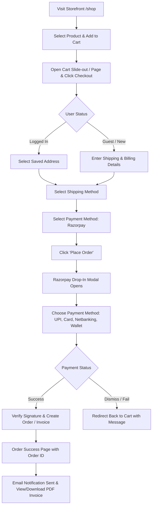

# ECOM Store: User Flow & Order Placement Guide
**A Step-by-Step Teaching Tutorial and Handover Guide for the Client**

---

## 1. Executive Summary & Implementation Status

All primary features requested in the **ECOM Project Requirements** have been implemented:

* [x] **Storefront & Navigation:** Custom minimal theme layout, `/shop` catalog page, header navigation, and empty app shell routes (`/home`, `/contact`, `/gallery`, `/reviews`).
* [x] **Shopping Cart & Checkout Flow:** One-page multi-step checkout (Address &rarr; Shipping &rarr; Payment &rarr; Review & Confirmation).
* [x] **Razorpay Payment Gateway Integration:** Complete end-to-end integration via the `Webkul/Razorpay` package with drop-in UI modal popup, order token generation, HMAC-SHA256 signature verification, and automated invoice/transaction creation.
* [x] **Store Currency Compatibility:** Store base currency is set to **INR** (Indian Rupee), satisfying Razorpay's currency requirements.
* [x] **Customer Accounts & Order History:** Registered users can view their orders, check fulfillment status, and download PDF invoices directly from their dashboard.
* [x] **Guest Checkout & Linking:** Guest checkout is enabled (`allow_guest_checkout = true`), and guest order session tracking/customer account linking listeners are configured.

---

## 2. Customer Journey: How a User Places an Order

Below is the complete step-by-step user journey from browsing to order confirmation:



### Step 1: Browse and Select a Product
1. The user visits the store at `/shop`.
2. The user browses the product grid, applies category/price filters, or clicks on a product card to view the **Product Detail Page (PDP)**.
3. On the product page, the user selects any required options (variants, quantity) and clicks **"Add to Cart"** (or **"Buy Now"**).
4. A notification confirms that the product has been added to the cart.

### Step 2: Review Cart & Proceed to Checkout
1. The user clicks the **Cart icon** in the top navigation bar.
2. The user can review item quantities, view the subtotal, and click **"Proceed to Checkout"**.
3. The checkout URL is: `/checkout/onepage`.

### Step 3: Address Details (Shipping & Billing)
* **If logged in:** The customer can select an existing saved address or add a new one.
* **If shopping as a guest:** The user fills in:
  * First Name & Last Name
  * Email Address & Contact Number
  * Street Address, City, State, Country (India), and Postal Code.
* By default, the billing address matches the shipping address (or the user can uncheck the box to provide a distinct billing address).
* Click **"Save & Continue"**.

### Step 4: Choose Shipping Method
1. The system displays available shipping carriers:
   * **Free Shipping** (Default / zero cost)
   * **Flat Rate Shipping** (Configured fixed rate)
2. The customer selects their preferred shipping option and clicks **"Save & Continue"**.

### Step 5: Choose Payment Method (Razorpay)
1. The available payment options are presented:
   * **Razorpay** (Debit/Credit Card, UPI, Netbanking, Wallets)
   * **Cash On Delivery** (COD)
   * **Money Transfer** (Direct bank wire)
2. The user selects **Razorpay** and clicks **"Place Order"**.

### Step 6: The Razorpay Secure Payment Screen
1. The customer is redirected to the secure Razorpay drop-in interface (`/razorpay-redirect`).
2. The official **Razorpay Checkout Modal** appears with:
   * Merchant Name and Logo
   * Order total in **INR (₹)**
   * Prefilled customer name, email, and phone number.
3. The user chooses their payment mode:
   * **UPI / QR Code:** Google Pay, PhonePe, Paytm, or generic UPI ID.
   * **Cards:** Visa, MasterCard, RuPay, Maestro.
   * **Net Banking:** All major Indian banks.
   * **Wallets:** Mobikwik, Freecharge, Airtel Money, etc.
4. **Test Mode Simulation:** When running in test/sandbox mode, the user or tester can click "Success" in the test Razorpay window or use standard Razorpay test card credentials.

### Step 7: Order Confirmation & Invoice Generation
1. Once Razorpay approves the transaction:
   * The browser returns to `/razorpay-success` with signed verification tokens (`razorpay_payment_id`, `razorpay_order_id`, `razorpay_signature`).
   * The backend validates the cryptographic HMAC signature against the store's Key Secret to ensure the payment is authentic.
   * The order is saved in the database with status **Processing**.
   * An **Invoice** is automatically generated and marked as **Paid**.
   * A **Payment Transaction** record is logged with the Razorpay Payment ID.
   * The cart is cleared.
2. The customer is shown the **Success Page** (`/checkout/onepage/success`) displaying their new **Order ID**.
3. An automated order confirmation email is queued/sent to the customer's email address.

### Step 8: Post-Purchase Tracking & Invoices
* **Logged-in Customers:**
  * Visit `/customer/account/orders`.
  * Click on the Order ID to view the order timeline (**Pending &rarr; Processing &rarr; Completed**).
  * Click **"Invoices"** and then **"Print"** to download the official PDF invoice.
* **Guest Customers:**
  * Receive full order details and order ID in their confirmation email.
  * If they later create an account using the same email address, their past guest orders are automatically linked to their new account.

---

## 3. Client Admin Guide: What You Need to Do

As the store owner/administrator, here is your action plan to manage and operate the store:

### A. Add Real Razorpay API Keys (Crucial Step)
Currently, the database has placeholder test keys (`TEST_CLIENT_ID` and `TEST_CLIENT_SECRET`). To make live payments or real sandbox test payments work, input your actual keys from Razorpay:

1. **Get your keys from Razorpay:**
   * Log in to your [Razorpay Dashboard](https://dashboard.razorpay.com).
   * For testing, toggle the switch at the top to **"Test Mode"**.
   * Go to **Account & Settings &rarr; API Keys &rarr; Generate Key**.
   * Copy the **Key ID** (starts with `rzp_test_...` or `rzp_live_...`) and the **Key Secret**.
2. **Enter keys in Bagisto Admin Panel:**
   * Open your browser and log into the admin dashboard at: `http://your-domain/admin/login`
   * In the left sidebar, navigate to **Settings &rarr; Configuration** (or **Configure**).
   * Expand the **Sales** group and click **Payment Methods**.
   * Scroll down to the **Razorpay** section.
   * Update the following fields:
     * **Status:** Set to `Yes` (Active).
     * **Title:** `Razorpay` (or `Credit/Debit Card / UPI / NetBanking`).
     * **Merchant Name:** Enter your business name (e.g., `ECOM`).
     * **Sandbox Mode:**
       * Set to `Yes` while testing.
       * Fill in **Test Client ID** (`rzp_test_...`) and **Test Client Secret**.
       * Set to `No` when going live, and fill in **Client ID** (`rzp_live_...`) and **Client Secret**.
   * Click **Save** in the top right corner.
   * Clear cache if required: `php artisan optimize:clear`.

---

### B. How to Fulfill and Manage Orders in the Admin Panel
1. Log in to the Admin Panel.
2. Go to **Sales &rarr; Orders** in the sidebar.
3. You will see all placed orders listed by Order ID, Customer Name, Status, and Total Amount.
4. Click on an order to view full details:
   * Items ordered.
   * Payment information (Razorpay Payment ID and captured status).
   * Invoices tab: View the generated invoice.
5. **Shipping an Order:**
   * When you are ready to dispatch the goods, click the **"Ship"** button on the order page.
   * Enter the Carrier Title (e.g., *BlueDart, Delhivery, India Post*) and the **Tracking Number**.
   * Click **"Create Shipment"**.
   * The order status automatically transitions to **Completed**, and a shipment dispatch email with tracking information is sent to the buyer.

---

## 4. Technical Observations & Recommendations

The requested deliverables have been put in place. Please keep the following developer points in mind:

1. **Guest Order Tracking View:**
   * A controller `OrderTrackingController.php` and route `Route::get('track-order', ...)` have been added to handle guest tracking via session.
   * **Action Required:** The Blade view file `packages/Webkul/Shop/src/Resources/views/tracking/index.blade.php` has not yet been designed/created. If you wish to have an open `/track-order` lookup page for visitors, create this Blade template. In the meantime, standard order tracking works for all logged-in customers via their account portal.
2. **Frontend Asset Builds:**
   * The `vite.config.js` file was configured to output to `themes/shop/ecom/build`.
   * Whenever you make styling or Blade changes in `packages/Webkul/Shop`, always compile the assets:
     ```bash
     cd packages/Webkul/Shop && npm run build
     ```
3. **Email / SMTP Configuration:**
   * Ensure your `.env` file has working SMTP credentials (`MAIL_MAILER`, `MAIL_HOST`, `MAIL_PORT`, `MAIL_USERNAME`, `MAIL_PASSWORD`) so order confirmation and invoice emails reach customers upon payment.
